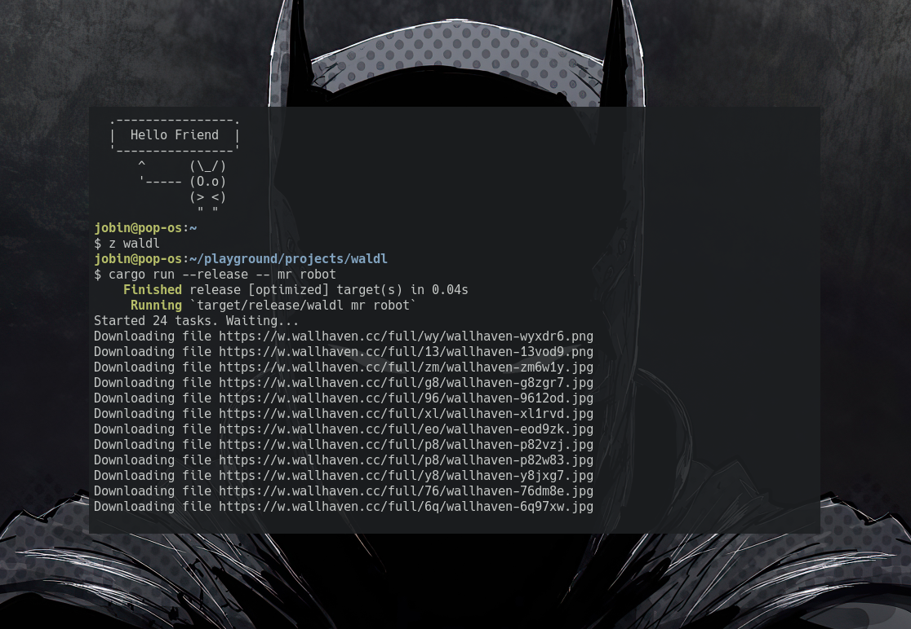

# Waldl

A basic wallpaper downloader written in rust, uses wallhaven API for downloading wallpapers in original format. 

Download is asynchronous downloads the images into `$HOME/Pictures/wallpapers/$(date "+%b_%d")/`
eg: `/home/jobin/Pictures/wallpapers/aug_15/`

## Installation

1. Clone the repo to anywhere in your system
    - `git clone --depth https://github.com/Jobin-Nelson/waldl.git`

2. cd into the waldl, install the binary
    - `cd waldl && cargo install --path .`

## Usage

`waldl Matthew McConaughey`

If you don't give any arguments it will download latest or top lists.

## Dependencies

- **reqwest**
- **tokio**
- **serde**
- **futures**

I've also build the same thing in python you can view that [here](https://github.com/Jobin-Nelson/.dotfiles/blob/main/scripts/waldl.py).
